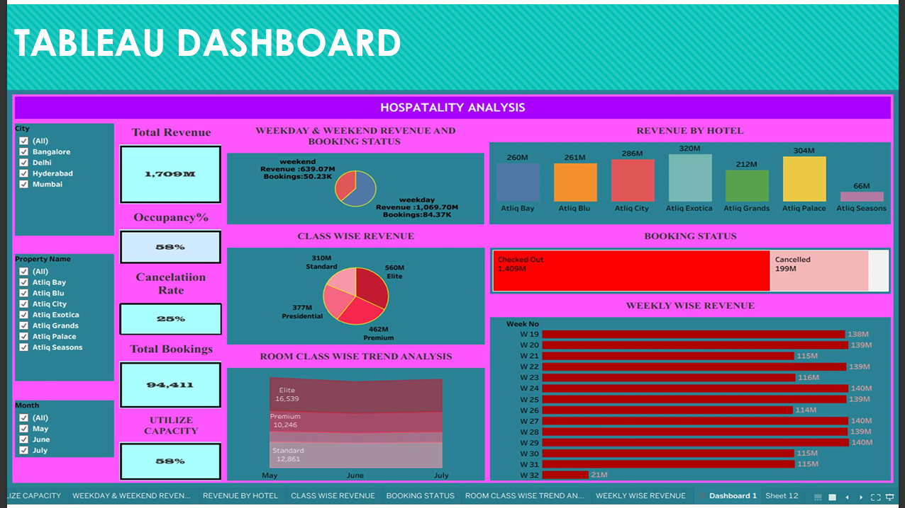

# Hospitality Dashboard Project
 
A curated set of dashboards and analytics assets for hospitality performance analysis. The repository includes Excel, Tableau and Power BI dashboards, plus the SQL used to calculate the key metrics.

Highlights
- Interactive Excel dashboard with macros and pivot-based visuals
- Two Tableau packaged workbooks (.twbx) showing layout and story-driven visuals
- Power BI report (.pbix) with KPI tiles and trend visuals
- SQL script used to aggregate bookings, revenue and occupancy metrics

Screenshots (click to view full-size)

Excel Dashboard — interactive Excel view with KPI tiles and filters

Power BI Dashboard — KPI tiles, weekday/weekend comparison, and revenue by property

Tableau Dashboard (1) — packaged workbook view showing class-wise revenue and booking trends

Tableau Dashboard (2) — alternate layout with weekly trend heatmap and property comparisons

Files in this repository
- `Hospitality Dashboard Excel.xlsm` — Excel workbook with VBA-enabled interactive dashboard
- `Hospitality Dashboard PDF.pdf` — exported PDF snapshot of dashboards
- `Hospitality Dashboard Power BI.pbix` — Power BI Desktop report file
- `Hospitality Dashboard Tableau.twbx` and `Hospitality Dashboard Tableau 2.twbx` — Tableau packaged workbooks
- `Hospitality Data Analysis SQL.sql` — SQL script with the queries used to build the dashboard aggregates

Quick SQL summary
- Total revenue: SUM(`revenue_realized`) from `fact_bookings`
- Occupancy / Utilization: computed from `fact_aggregated_bookings` joined with `dim_date`/`dim_property`
- Cancellation rate: COUNT where `booking_status = 'Cancelled'` divided by total bookings
- Trend analysis: daily and weekly groupings by `check_in_date` and `week_no`

How to view
- Excel: open `Hospitality Dashboard Excel.xlsm` in Microsoft Excel and enable content/macros
- Tableau: open the `.twbx` files in Tableau Desktop
- Power BI: open `Hospitality Dashboard Power BI.pbix` in Power BI Desktop
- SQL: run `Hospitality Data Analysis SQL.sql` in your SQL client connected to the hospitality dataset

Notes & next steps
- The repository contains binary report files — consider adding a small sample CSV and a data dictionary for reproducibility.
- I can also add a short `LICENSE` (MIT), compress screenshots for a smaller repo, or add a `USAGE.md` with sample queries and expected outputs.

---

If you'd like any wording changes, different screenshots, or smaller images for a lighter repo, tell me which and I'll update and push.

