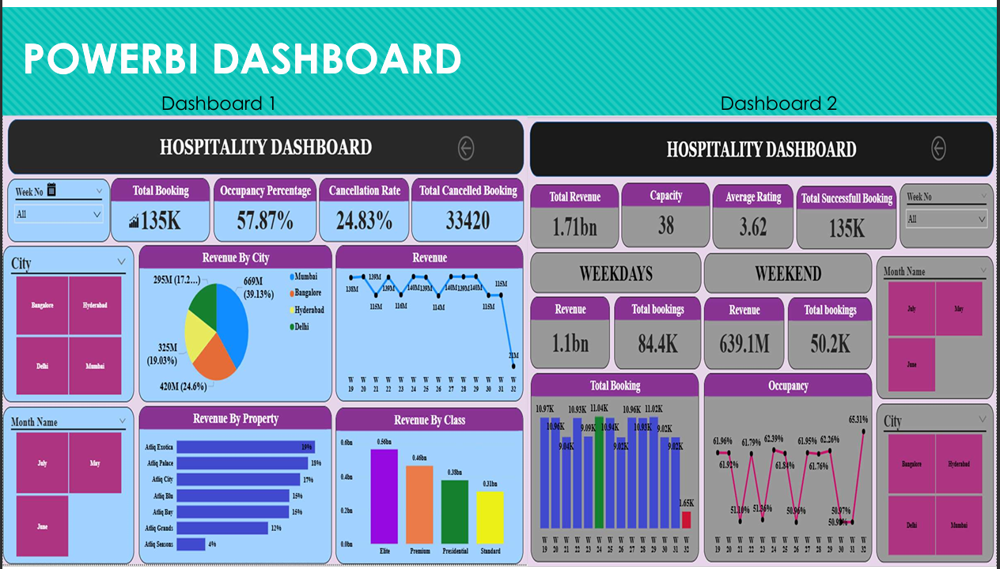
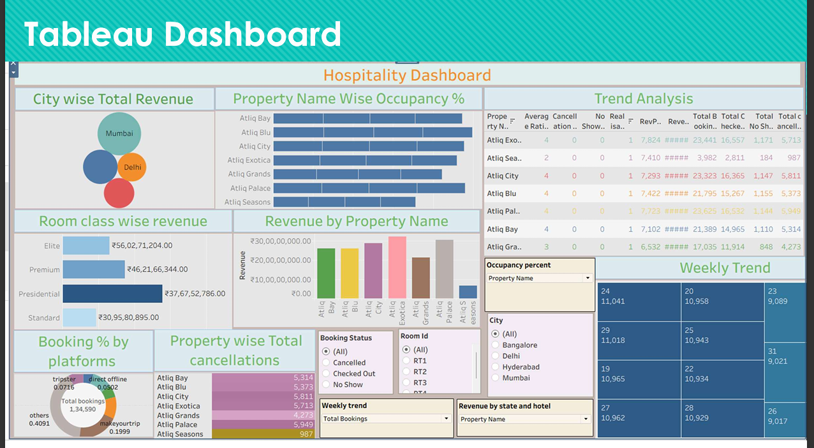
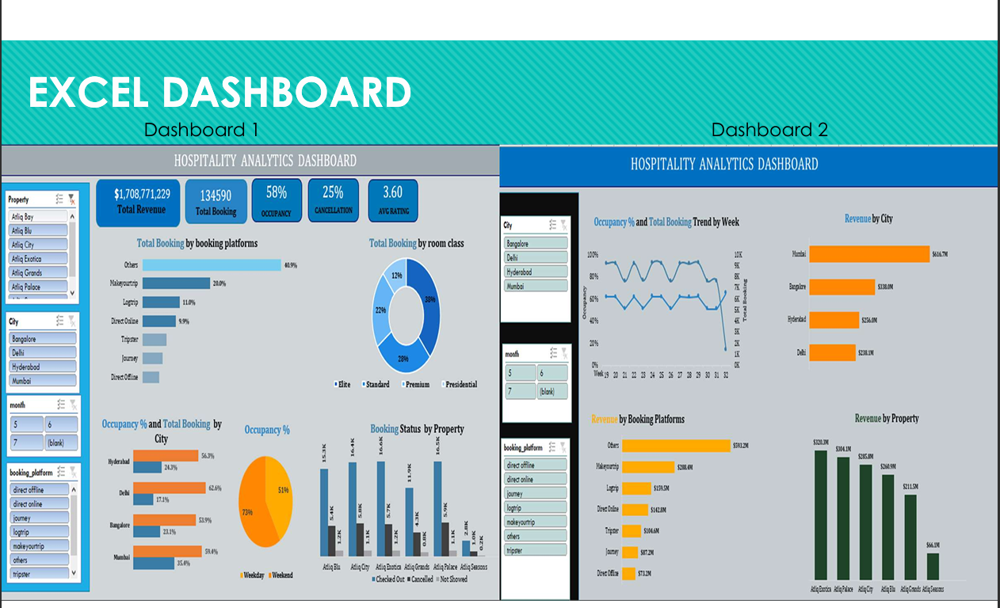

# Hospitality Dashboard Project

A collection of dashboards and analysis artifacts built from a hospitality dataset — Excel dashboards, Tableau workbooks, Power BI reports, and the SQL used to prepare metrics.

**Highlights**
- Interactive Excel dashboards (macros-enabled)  
- Packaged Tableau workbooks (.twbx)  
- Power BI report (.pbix)  
- SQL queries used to compute revenue, occupancy, cancellation rate, and trend analysis

**Screenshots**

Large previews of the project dashboards and visuals (click to view full size):

## Files in this repository
- Hospitality Dashboard Excel.xlsm — Macro-enabled Excel workbook with dashboards and analyses.  
- Hospitality Dashboard PDF.pdf — Exported PDF of dashboards and report.  
- Hospitality Dashboard Power BI.pbix — Power BI Desktop report.  
- Hospitality Dashboard Tableau 2.twbx — Packaged Tableau workbook.  
- Hospitality Dashboard Tableau.twbx — Packaged Tableau workbook (alternate).  
- Hospitality Data Analysis SQL.sql — SQL script containing the queries used to compute metrics.

## SQL summary (quick)
- Total revenue: sum of `revenue_realized` from `fact_bookings`.  
- Occupancy / utilization: calculated from `fact_aggregated_bookings` and `capacity`.  
- Cancellation rate: percent where `booking_status = 'Cancelled'`.  
- Total bookings: distinct `booking_id`.  
- Trends: daily and weekly revenue/bookings (by `check_in_date`, `week_no`).

## How to view
- Open the Excel file with Microsoft Excel (enable macros to use interactive features).  
- Open the `.twbx` files with Tableau Desktop.  
- Open the `.pbix` with Power BI Desktop.  
- Run `Hospitality Data Analysis SQL.sql` in your SQL client connected to the dataset schema.

## Notes & suggestions
- This repository currently stores binary report files — consider adding small CSV sample extracts and a data dictionary to make the project more reproducible.  
- Optionally add a `LICENSE` file (e.g., MIT) if you want to publish the project publicly.

---

If you'd like, I can also:
- add a short `LICENSE` (MIT) and push it,  
- optimize the screenshots (resize / compress) before commit, or  
- create a short CONTRIBUTING or USAGE guide with sample SQL/result snapshots.

